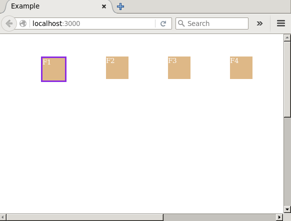

UI lib based on react for TV web apps

### Build

1. Install the dependencies:

```
npm install
```
2. Build
```
npm run build
```
you will get dist/react-tv.js and react-tv.min.js

### Run the example 
change dir to react-tv\example\simple
```
npm run start
```


### npm package 
https://www.npmjs.com/package/react-tv-ui